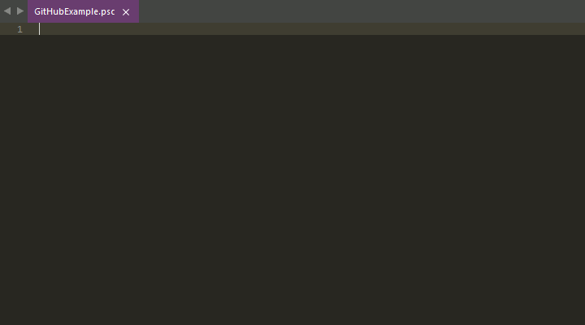

**SublimePapyrus**
==
A Sublime Text 2 and 3 package for the Papyrus scripting language.

# **Contents**
- [Description](#description)
- [How to install](#how-to-install)
- [Core features](#core-features)
- [Modules](#modules)
- [Changelog](#changelog)
- [License](#license)

## **Description**
SublimePapyrus is a package that aims to provide a development environment for a scripting language called [Papyrus](http://www.creationkit.com/Category:Papyrus) within [Sublime Text](https://www.sublimetext.com/). The package is split into a core package and additional packages for specific games and/or resources. The core package is always required, but the other packages usually depend upon the core package or one of the other packages.

The example above shows the syntax highlighting, code completion, and tooltips in action ([*Moka Dark* theme](https://github.com/aldomann/sublime-moka) is used in the example).

## **How to install**
- Download a [release](https://github.com/Kapiainen/SublimePapyrus/releases).
- Start Sublime Text.
- Click on the *Browse Packages...* option in the *Preferences* section of Sublime Text's toolbar.
- The *"\Data\Packages"* folder should now be open. Browse to *"\Data\Installed Packages"*.
- Open the release archive that was downloaded and extract the *.sublime-package* files to *"\Data\Installed Packages"*.
- Restart Sublime Text.
- Open the default settings (*Preferences > Package Settings > SublimePapyrus > Settings - Default*) and copy the contents into the user settings (*Preferences > Package Settings > SublimePapyrus > Settings - User*).
- Set the paths of the *compiler*, *output*, and *import* settings of the game(s) you will be working with. **Note that the *import* setting is an array of strings. The contents of earlier entries override the contents of later entries when the compiler looks for a script.**
- Modify the remaining settings to your liking. See the *[Settings](#settings)* section for more information on what each setting does.

Enabling Sublime Text's ***auto_complete_with_fields*** setting is highly recommended in order to get the best experience.

## **Core features**
- [Build system framework](#build-system-framework)
 - Single file build
 - Batch build
 - Hide successful build results
 - Highlight build errors
- [Valid key insertion framework](#valid-key-insertion-framework)
- [Commands](#commands)
 - Open script
 - Clear error highlights
- [Settings](#settings)

#### Build system framework
The core of this package contains a flexible build system framework that should be able to handle most situations. The build system supports both single file and batch building, multiple import folders, and additional arguments. Lines in the source code that cause build errors can also be highlighted and brought to the center of the screen. Attempts to batch build one of the folders defined in the import folders setting will show a warning prompt. If no output folder is specified in the user settings, then the compiled script will be placed one level above the script source (e.g. *"\Scripts\Source\Example.psc"* is compiled to *"\Scripts\Example.pex"*).

#### Valid key insertion framework
Certain functions have a limited pool of valid values that can be used as the argument and some functions return specific values based on e.g. the object that the function was called on. ***Insert **** commands open a panel that lists either the description and the value, or just the value that will be inserted when chosen.

#### Commands
- Open script
  - This command brings up an input panel and uses the input string to find matching files in the import folders that have been defined in the settings. The syntax highlighting that is active is used to figure out which module's import folders setting to use. Any text that is selected when running this command is used as the initial text to search for. 

- Clear error highlights
  - This command just clears all error highlights (build errors, linter errors, etc.) that have been applied by this package.

#### Settings
Settings are located in *Preferences* > *Package Settings* > *SublimePapyrus*.

- All modules
  - ***linter_on_save***: Run the linter whenever a script is saved. This setting also needs to be enabled for automatic cache invalidation of the linter and intelligent code completion systems. If this setting is disabled, then from time to time you may have to manually run the command to clear the cache to update e.g. the completions. Default: True

  - ***linter_on_modified***: Run the linter whenever a script is modified. Default: True

  - ***linter_delay***: The delay in milliseconds between the last modification of a script and the linter being triggered. Default: 500

  - ***linter_panel_error_messages***: Another method of showing error messages in addition to the messages that are shown in the status bar that is located at the bottom of Sublime Text's windows. If one wishes to see error messages in Sublime Text 2, then it is recommended that one enables this setting as messages regarding a script being saved override the linter's error messages. Default: False
  
  - ***linter_error_line_threshold***: The number of lines that an error can be moved up or down before it is considered to be a new error that should be brought to the center of the view. Default: 2

  - ***intelligent_code_completion***: Enables the code completion system that uses cached results from the linter to provide context-aware completions. Default: True

  - ***intelligent_code_completion_function_event_parameters***: Determines if function/event parameters should be included in completions for function/event calls. Default: True

  - ***tooltip_function_parameters***: Determines if a tooltip shows up with information about the parameters of the function/event call that is being edited. Default: True

  - ***tooltip_function_docstring***: Determines if a tooltip shows up with the docstring of the function/event call that is being edited. Default: True

  - ***tooltip_background_color***: Hex color code of a tooltip's background. Default: #393939
    
  - ***tooltip_body_text_color***: Hex color code of a tooltip's text. Default: #747369
    
  - ***tooltip_font_size***: The size (in pixels) of a tooltip's text. Default: 12
    
  - ***tooltip_bold_text_color***: Hex color code of a tooltip's bold text. Default: #ffffff
    
  - ***tooltip_heading_text_color***: Hex color code of a tooltip's heading. Default: #bfbfbf
    
  - ***tooltip_heading_font_size***: The size (in pixels) of text in a tooltip's heading. Default: 14

  - ***tooltip_max_width***: The maximum width (in pixels) of the tooltip. Default: 600
  
  - ***tooltip_max_height***: The maximum height (in pixels) of the tooltip. Default: 300

  - ***center_highlighted_line***: Automatically scrolls the view so that a highlighted line is in the center of the view. Default: True

  - ***highlight_build_errors***: Highlights lines that cause attempts to compile scripts to fail. Default: True

  - ***hide_successful_build_results***: Hides the panel that shows build results, if there were no issues during compilation. Default: False

  - ***batch_compilation_warning***: Shows a warning in the scenario where batch building would involve compiling scripts in one of the folders that have been defined in the relevant module's import folders setting. Default: True

  - ***open_script_split_paths***: Determines whether or not to split the paths to the scripts listed in the panel, which the *Open script* command brings up, into file and folder name. The full path to a script may get cut off if it is long enough. Splitting the path makes it easier to see the name of the script even when the full path is long. Not splitting the path allows for filtering scripts based on the contents of the folder path in addition to the script name. Default: True

- Build settings specific to each module
  - ***compiler***: The path to the compiler executable.

  - ***flags***: The name of the file containing information about flags (e.g. *"TESV_Papyrus_Flags.flg"* for Skyrim). A file by this name is expected to exist in at least one of the import folders.

  - ***output***: The path where compiled scripts should end up.

  - ***import***: A list of paths to folders containing script sources. Earlier entries override later entries. If one wanted to override Skyrim's script sources with script sources from Skyrim Script Extender (SKSE), then the path to SKSE's script sources should have a lower index than the path to Skyrim's script sources.

  - ***arguments***: A list of strings that are added at the end when invoking the compiler. Can be used to include additional options when invoking the compiler.

## **Modules**
- [The Elder Scrolls V: Skyrim](#the-elder-scrolls-v-skyrim)
 - [Skyrim Script Extender](#skyrim-script-extender-skse)
 - [Immersive First Person View](#immersive-first-person-view-ifpv)
- [Fallout 4](#fallout-4)

### **The Elder Scrolls V: Skyrim**
- [Syntax highlighting](#syntax-highlighting)
- [Linter](#linter)
- [Intelligent code completion](#intelligent-code-completion)
- [Tooltips](#tooltips)
- [Build systems](#build-systems)
- [Commands](#commands-1)
 - Generate completions
 - Valid key insertion
    - Actor value
    - Form type
    - Tracked statistic
    - Animation variables
    - Game settings
 - Clear cache

#### Syntax highlighting
Syntax highlighting for the version of Papyrus that is used in ***The Elder Scrolls V: Skyrim***.

#### Linter
Requirements:
- The linter has to be enabled in the settings.

The linter performs lexical, syntactic, and semantic analysis on the source code of scripts as they are being edited and/or when they are saved. Lines that cause errors are highlighted and the error messages are shown as status messages (bottom left corner of Sublime Text).

Caching is used by the linter in order to improve performance and cache invalidation only occurs in a few scenarios. Modifications to the import folders setting (e.g. changing the order of paths) requires a restart of Sublime Text in order to clear the cache and ensure that the right scripts are being used.

The linter does work in Sublime Text 2, but error messages and highlighting is not possible when the linter is triggered by editing a script due to technical limitations in the API of Sublime Text 2. Error messages and highlighting is possible in Sublime Text 2 when the linter is triggered by saving a script.

Information about settings relevant to the linter can be found **[here](#settings)**.

#### Intelligent code completion
Requirements:
- The system has to be enabled in the settings.
- The same requirements as in the case of the linter.
- The script has to have been processed by the linter.

The intelligent code completion system utilizes the linter to produce suggestions in a context-aware manner. This system can:
- Return completions for all functions, events, properties, and variables (including function/event parameters) that exist within the scope of the line that is being edited. This includes functions, events, and properties that have been inherited from a parent script, if a parent script has been defined.

- Determine if a completion for a function/event should be in the form of a function/event definition or a function/event call.

- Return completions for all scripts that exist within the import folders that have been defined in the package settings.

- Return keyword completions based on the context of the line that is being edited (e.g. applicable function/event/property flags).

- Provide information about the object behind the completion (e.g. a function's return type, a variable's type, whether a variable is a function/event parameter, the origin of the completion).

Caching is used by the intelligent code completion system in order to improve performance. Saving a script invalidates the portions of the cache that would be affected by modifications to that script.

There is a [setting](#settings) to turn this feature off. If this feature is disabled, then one can generate completions with the ***Generate completions*** command, but these completions will show up as suggested completions regardless of the context.

#### Tooltips
Requirements:
- The feature has to be enabled in the settings.
- The same requirements as in the case of the linter.
- Sublime Text 3 build 3070 or newer.

Shows additional information. The appearance of tooltips can be customized (e.g. font size, color, maximum dimensions) via the settings.

Currently supported tooltips:
- Show information about the function/event call that is being edited. The displayed information includes the name of the function/event, the parameters and their default values, and which parameter corresponds to the argument that is being edited. This feature can be toggled in the settings.

#### Build systems
Single file build system and a batch build variant.

#### Commands
- Generate completions
  - This command uses the linter to generate completions for functions, events, and script names. A panel with all the import folders is shown so that one can choose which set of script sources to process. If there are a lot of script sources in a particular folder, then it can take a while to finish processing.
  - Do note that this command does not need to be run when using the intelligent completions system and has nothing to do with the aforementioned system. The command is intended as an option for situations where running the linter and the intelligent completion system is not feasible (e.g. on a low-power device with poor performance).

- Valid key insertion
  - Information about this command can be found **[here](#valid-key-insertion-framework)**.
    - Actor values names
    - Form type IDs
    - Tracked statistic names
    - Animation variable names (boolean, float, and integer)
    - Game setting names (float, integer, and string)

- Clear cache
  - Clears the caches relevant to the linter and code completion. Can be used to refresh the linter and code completion after modifying the contents of the ***import*** setting (e.g. adding a new folder or changing the order of folders) or the contents of one of the folders specified in the ***import*** setting (e.g. saving a new script).

#### **3rd party resources for Skyrim**
##### Skyrim Script Extender (SKSE)
- Commands
 - Valid key insertion

###### Commands
- Valid key insertion
  - Information about this command can be found **[here](#valid-key-insertion-framework)**.
    - Menu names
    - Input keycodes
    - Control names
    - DefaultObject names
    - ActorValueInfo names and IDs
    - Actor action IDs
    - Player camera state IDs

##### Immersive First Person View (IFPV)
- Commands
 - Valid key insertion

###### Commands
- Valid key insertion
  - Information about this command can be found **[here](#valid-key-insertion-framework)**.
    - Config value names (boolean, float, integer, and string)
    - SKSE mod event names

### **Fallout 4**
- [Syntax highlighting](#syntax-highlighting-1)
- [Linter](#linter-1)
- [Intelligent code completion](#intelligent-code-completion-1)
- [Tooltips](#tooltips-1)
- [Build systems](#build-systems-1)
- [Commands](#commands-2)

#### Syntax highlighting
Syntax highlighting for the version of Papyrus that is used in ***Fallout 4***.

A variant, which supports the language extensions supported by the [Caprica](https://github.com/Orvid/Caprica) compiler, is also included. This variant has to be selected in order for the linter and intelligent completion systems to also support the language extensions.

#### Linter
Requirements:
- TBD

#### Intelligent code completion
Requirements:
- TBD

#### Tooltips
Requirements:
- TBD

#### Build systems
PLACEHOLDER

#### Commands
PLACEHOLDER

## **Changelog**

**Version x.x.x - YYYY/MM/DD:**

- **Core**
  - Added support for nested folders in *Open script* command.

- **Fallout 4**
  - Added syntax highlighting.
  - Added completions.

**Version 2.6.7 - 2016/12/12:**

- **Skyrim**
  - Added support for completions, which had previously been omitted, directly after the **Return** keyword in functions with a defined return type.

**Version 2.6.6 - 2016/12/11:**

- **Skyrim**
  - Fixed a typo that caused the plugin to crash under certain circumstances.

**Version 2.6.5 - 2016/12/10:**

- **Skyrim**
  - Updated some error messages.
  - Fixed validation of function return types and return statements.
  - Fixed missing quotation marks in the default values of string arguments in function completions.
  - Added validation of the size of the int literal used to initialize an array.
  - Added validation of the assignment operator used to assign to an array element.
  - Updated the validation of assigment statements.
  - Updated the definition of float literals in lexical analysis.

**Version 2.6.4 - 2016/12/07:**

- **Skyrim**
  - Fixed a bug that caused the plugin to crash in Sublime Text 2 when the linter processed multiple scripts with lexical, syntactic or semantic issues and the *linter_panel_error_messages* setting was enabled.

**Version 2.6.3 - 2016/12/06:**

- **Core**
  - Updated readme to clarify certain aspects of installing and setting up the package.

**Version 2.6.2 - 2016/11/05:**

- **Skyrim**
  - Added exception handling to the plugin and linter to catch UnicodeDecodeError errors raised when attempting to read scripts while using the default encoding of the operating system's locale.
  - Added a confirmation dialog to the 'Generate completions' command when attempting to process more than 100 scripts.

**Version 2.6.1 - 2016/10/21:**

- **Skyrim**
  - Fixed issue that caused errors when attempting to call *Find* and *RFind* functions on arrays of base types.
  - The name of the first argument in the completions for the *Find* and *RFind* functions of arrays now changes based on the array's element type (abElement, afElement, aiElement, asElement, or akElement).

**Version 2.6.0 - 2016/05/14:**

- **Core**
  - Added a boolean setting for displaying docstrings in function/event call tooltips.
  - Added a warning to the build system framework for when an import path defined in a module's settings does not actually exist on the filesystem.

- **Skyrim**
  - Added docstring support to classes representing scriptheaders, functions, events, and properties in the linter.
  - Added support for displaying docstrings in tooltips for function/event calls.

**Version 2.5.0 - 2016/05/05:**

- **Skyrim**
  - Added indentation and comment rules with a .tmPreferences file.
  - Fixed a bug in the linter. The bug caused accessing the *Length* property of bool, float, int, and string arrays to throw a semantic error.

**Version 2.4.0 - 2016/04/30:**

- **Core**
  - Added setting for splitting the full paths to scripts into filenames and folder paths in the *Open script* command.

- **Skyrim**
  - Shortened descriptions in definition completions (e.g. state, function).
  - Updated syntax highlighting to support whitespace between function/event identifiers and left parentheses in function/event definitions.
  - Fixed incorrect syntax highlighting when passing '\<identifier\> == \<expression\>' as an argument. It was previously highlighted as if one were passing an argument while specifying the corresponding parameter identifier.

- **Fallout 4**
  - This module has been removed until further notice. The changes made in the latest version of Papyrus, which is used in Fallout 4, are extensive and incompatible with e.g. the build system framework. The package provided by Bethesda on the official Fallout 4 Creation Kit wiki should be used while this module is being developed.

**Version 2.3.0 - 2016/04/27:**

- **Core**
  - Added support for "arguments" setting in build systems.

- **Fallout 4**
  - Added "Release" and "Final" build systems to Fallout 4.

**Version 2.2.0 - 2016/04/27:**

- **Core**
  - Added the ability to use the *Open script* command in views that do not have a compatible syntax. An additional panel, which allows you to select which module's *import* paths should be used, opens up after you enter the (partial) name of the script to look for.
  - Added support for listing all scripts with the *Open script* command by typing in an asterisk (\*) as the only character.
  - Added an optional *title* setting to module settings. The string value is used when listing modules by name. If this setting does not exist, then the module's key is used instead in listings.

- **Fallout 4**
  - Added syntax highlighting.
  - Added basic completions.
  - Added build systems.
  - Added module settings.

**Version 2.1.1 - 2016/04/22:**

- **Skyrim**
  - Code completion
    - Added completions for imported global functions when defining arguments in function/event calls.
  - Tooltips
    - Refactored tooltips for function/event parameters in order to reduce the amount of work that is done.
    - Added parameter tooltips for imported global functions.

**Version 2.1.0 - 2016/04/19:**

- **Core**
  - Added new settings for toggling tooltips and customizing the looks of tooltips.
  - Added a setting to toggle function/event parameters in function/event call completions.

- **Skyrim**
  - Added an optional tooltip that shows the name of the function/event and its parameters when typing inside of a function/event call (Sublime Text 3 build 3070 or newer only).
  - Linter
    - Fixed validation of explicit casting.
    - Fixed argument validation in function calls.
    - Added restrictions imposed on functions by the 'Global' keyword to the semantic analysis.
    - Added a warning when no import paths are passed to the semantic analysis (e.g. if no paths have been defined in the settings).
  - Code completion
    - Updated completions for functions/events in states.
    - Added completions for parameters of the function/event that is being called.
    - Added back completions for inherited functions/events that had been missing since the previous version.

**Version 2.0.0 - 2016/04/16:**

- **Core**
  - The build system now places the compiled script one folder above the script's source file (*"\Scripts\Source\Example.psc"* is compiled to *"\Scripts\Example.pex"*) if no output folder has been specified in the user settings.
  - Updated function, event, and property completions to always include the source (i.e. the script) that the completions are from.
  - The *Open script* command automatically uses the first selection, if a piece of text has been selected, as the initial value.
  - Added a new setting (***linter_error_line_threshold***) that defines how many lines a linter error can move up or down by between passes before it is considered a new error that should be centered.

- **Skyrim**
  - Added a command to manually clear the various caches relevant to the linter and code completion without needing to restart Sublime Text. It is useful when modifying the contents of the *import* setting in the user settings or one of the folders specified in that setting.
  - Linter
    - Switched from using filenames to using a view's buffer ID for identification purposes. Scripts no longer have to have been saved to a file for the linter, and subsequently the code completion, to work.
    - Switched to using the unmodified lexical and syntactic analysis classes in semantic analysis when processing other scripts in order to get their properties, functions, and events.
    - Changed the way that lexical and syntactic analysis are performed in an effort to catch syntactic errors earlier.
    - Semantic analysis has been modified to no longer discard statements after use and instead store them in an object, which represents the script and can be used by the code completion system.
    - NodeVisitor now returns an object with *type*, *array*, and *object* fields instead of just a string.
    - Error messages in the status bar are now persistent until they have been resolved.
    - Removed gutter icon from highlighted lines.
    - Errors are no longer centered multiple times unless either the line with the error has moved up or down more than specified in the user settings (default: 2 lines) or there has been a linter pass without errors. 
    - Modified error messages.
    - Fixed *GetPath* so that it works in a Unix environment where many file systems are case-sensitive.
    - Fixed a bug that caused issues when using identifiers starting with 'true' and 'false'.
    - Fixed NodeVisitor so that it returns the correct values from binary operator nodes involving comparison or logical operators.
    - Fixed a bug that caused non-global functions from imported scripts to be taken into account when checking for ambiguous function calls.
    - Fixed a bug that stopped casting 'self' to a type that extends the current script.
    - Fixed a bug that prevented the use of 'self' as an argument in function calls when the parameter type is the same as the current script.
    - Added specific warnings when declaring a variable/property with an identifier that is already in use in a property declaration in a parent script.
    - Added support for distinguishing between attempts to call global and non-global functions.
    - Added errors when attempting to use the *Self* or *Parent* variables in functions with the *Global* keyword.
    - Added validation of function return types.
    - Added more specific exceptions (e.g. when expecting a type, a literal, a keyword, or an identifier).
    - Added an error about casting to non-existing types.
    - Added an error when attempting to cast an expression that does not return a value.
    - Added errors when attempting to explicitly cast outside of the chain of inheritance of the type that the left-hand side expression evaluates to.
    - Added an error when attempting to access properties, functions, or events of expressions that evaluate to a base type or nothing.
    - Added an error when a variable's, property's, or parameter's name is the same as a known type.
    - Added an error when attempting to assign a non-array value to an array.
    - Added an error when attempting to use a type as if it were a variable (e.g. accessing a property directly via a type).
    - Added errors when attempting to incorrectly use arithmetic or logical operators.
  - Code completion
    - Performance has been improved by caching the result of the linter's semantic analysis.
    - More scenarios are now supported (e.g. keywords in script headers, variable declarations, property declarations, function/event declarations).
    - The source (the current script, the parent script, or another script) of the completion is specified.

**Version 1.0.7 - 2016/03/10:**
  - Fixed a bug in the 'Generate completions' command.
  - Linter optimizations.

**Version 1.0.6 - 2016/03/09:**
  - Fixed an issue that produced incorrect completions for array parameters in function and event completions.

**Version 1.0.5 - 2016/03/08:**
  - Fixed string literal regex in the linter.

**Version 1.0.4 - 2016/03/05:**
  - Fixed a bug in the linter related to casting from arrays to other types.
  - Fixed a bug that caused certain completions to be suggested outside of function/event definitions when they should not.

**Version 1.0.3 - 2016/03/05:**
  - Added completions for Find and RFind functions for arrays.
  - Added missing return type in the description of the GetState function's completion.

**Version 1.0.2 - 2016/03/05:**
  - Fixed a bug in the linter involving validation of array arguments and array parameters in function calls.

**Version 1.0.1 - 2016/03/05:**
  - Implemented support in the linter for Find and RFind functions for arrays.
  - Implemented support in the linter for documentation strings for functions and events with the Native keyword.

**Version 1.0.0 - 2016/03/04:**
  - Major rewrite
  - Introduction of version numbers

## **License**

See [**LICENSE.md**](LICENSE.md) for more information.
